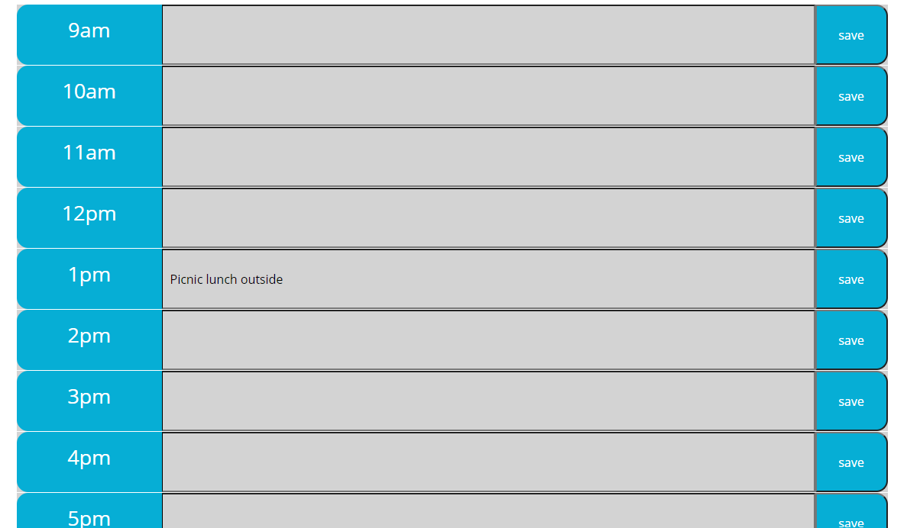

# Work Day Planner

## Table of Contents

* [Description](#description)
* [Links](#links)
* [Screenshots](#screenshots)
* [Installation](#installation)
* [Usage](#usage)
* [Technologies Used](#technologies)
* [Questions](#questions)

## Description

A simple calendar application that allows the user to save events for each hour of the day. This app will run in the browser and feature dynamically updated HTML as it keeps track of the current time and date using moment.js library. JavaScript powered by jQuery.

## Links

[Deployed Day Planner](https://benimahat1291.github.io/DayPlaner/)

## Screenshots

## Installation Instructions

open index.html in you default web browser

## Usage

In the test area enter your plans for the specific hour and save with the button on the left side slot. 

## Technologies Used

HTML, CSS, JS, Jquerry, Moment.js

## Questions

If you have further projects and questions, you can find me on Github: [GITHUB](https://github.com/benimahat1291). 
please visit my portfolio to find contact information: [BENI MAHAT](https://benimahat1291.github.io/Portfolio_v2/#/). 
